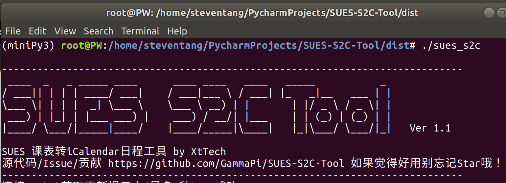
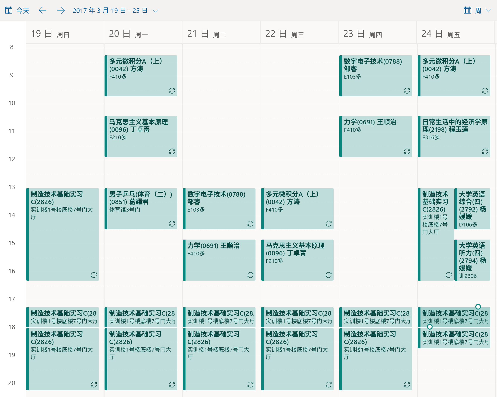
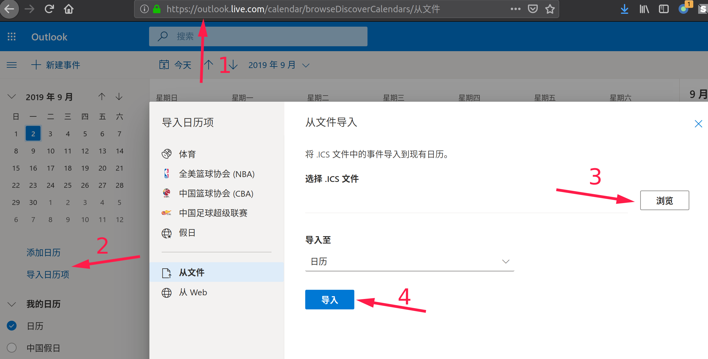

```
 ____  _   _ _____ ____      ____ ____   ____   _____           _ 
/ ___|| | | | ____/ ___|    / ___|___ \ / ___| |_   _|__   ___ | |
\___ \| | | |  _| \___ \    \___ \ __) | |       | |/ _ \ / _ \| |
 ___) | |_| | |___ ___) |    ___) / __/| |___    | | (_) | (_) | |
|____/ \___/|_____|____/    |____/_____|\____|   |_|\___/ \___/|_|

```
# 简介

## 什么是SUES S2C Tool?


S2C的意思是schedule to calendar。这个小工具能够将上海工程技术大学(SUES)教学信息管理系统上的课表转换成通用的电子日历文件(.ics)。有了.ics文件，你可以在不安装额外软件的情况下，在几乎全平台的设备上同步课程表，并收到上课提醒。

SUES S2C Tool 开源、免费、开箱即用，是管理SUES课表的大杀器~

欲知道如何安装、导出课表、进行同步，请查看继续查看Readme.md

**本工具开源，因此任何人都可能进行修改或重新打包**
**请您务必直接下载本代码仓库release页面的可执行文件并核对sha码（有python环境直接从源代码运行更好）**
**近期其他学校有出现类似脚本被二次打包后导致学校系统出现攻击告警。开发者不承担因用户使用非本页面发布的程序而导致问题的责任。**

```
Windows程序的查毒报告见
http://r.virscan.org/language/zh-cn/report/4ddb19c5782e9d3def214d0f62701ec4

文件名称 :sues_s2c-windows-32.Ver1.1.exe
文件大小 :11722477 byte
文件类型 :PE32 executable for MS Windows (console) Intel 80386 32-bit
MD5:d58cbc27aabf25747f8d78485e14db82
SHA1:5181d7885f83a178881be0bae38678aa64786a30
SHA256:9030f315c47d052aa91594b6f72dd61bc3218fb53185fd595faa60f00699aeec
```


## 特性
- 全自动获取课表
- 支持所有学年、所有学期课表获取
- D、E、F楼上课时间可自动修正 （可选）
- 跨休息时间的日程自动拆分
- 转换为.ics文件后可在几乎全平台的设备上同步而无需预装任何软件
- 转换为.ics文件并导入设备后能够精确查看课程时间，不再需要按周次推算。可以设置上课前数分钟在设备上弹出提醒
- 开源、免费、开箱即用,无隐私担忧
- 代码注释丰富、扩展容易，没有协议限制，可以用来二次开发更多应用

导入日历后的效果


## What is SUES S2C Tool?

SUES S2C Tool is a python script that helps you to convert course schedule to a universal electronic calendar file(.ics) that can be added and synced through devices across platform without installing any extra software.

It's a opensource free tool that just works! Perfect for managing course schedule~  

## 我为什么要做这个小工具？
### 现有课表查看方法的缺点

目前大家想要看课表一般有这几种方式：登录教学系统查看、把课表打印下来/截图、使用专门的APP或小程序（超级课程表、课程盒子、zsqw123同学写的[课表APP](https://github.com/zsqw123/SUESjxxt)、马学长和BC同学写的微信课表小程序）等。

这些方式无法满足我的要求，因为：
- 登录教学系统和打印下来 过于繁琐，不方便查看
- 使用第三方APP需要在手机上安装软件，而奉行极简主义、不爱广告、不喜欢开过多后台程序、注重隐私的我非常不愿安装这些程序到我的设备上
- 使用第三方APP/小程序 大多需要把我的帐号密码提供给第三方的服务器，因为隐私的顾虑我不喜欢这样做
- 使用第三方APP/小程序 无法做到跨平台（我同时在用Linux、Windows系统的电脑和多台安卓手机）
- 使用第三方APP/小程序 无法做到跨平台提醒功能，即要上课了我正在用的设备主动提醒我要去上课

### 使用SUES S2C Tool将课表转为电子日历的优势

所以就有了SUES S2C Tool！这个小工具能够将课表转换成通用的电子日历档“.ics”文件。现在几乎所有你日常使用的终端设备都有预装有“日历”软件，将.ics文件添加到内置的日历软件并进行一定设置后就能够：

- 不用预装任何软件就能在任意数量的安卓/苹果/塞班等手机和Linux/Windows/Mac电脑甚至是一些智能手表上查看到课表
- 可以自己设定上课数分钟前发送通知提醒你，且这个提醒是跨设备同步的

在隐私保护方面，SUES S2C Tool代码开源，不必连接第三方服务器。运行一次后生成日历.ics文件后就可以删掉了。

# 安装SUES S2C Tool

SUES S2C Tool使用python编写，代码开源，免费。主要有以下三种方式可以进行安装：

## 方式一、下载打包好的程序

## Windows

在Windows10下使用pyinstaller打包

请去[Release页面](https://github.com/GammaPi/SUES-S2C-Tool/releases)下载sues_s2c-windows-32.exe

## Linux

在Ubuntu18.04下使用pyinstaller打包

```bash
wget https://github.com/GammaPi/SUES-S2C-Tool/releases/download/v1.0/sues_s2c-linux-32
chown u+x sues_s2c-linux-32
./sues_s2c-linux-32
```

## Mac

请参照方式二，有Mac环境的同学可以用pyinstaller打包提交pull request

## 方式二、直接运行脚本
安装python 3.x版本

```basg
git clone https://github.com/GammaPi/SUES-S2C-Tool.git
cd SUES-S2C-Tool
pip install -r requirements.txt
python sues_s2c.py
```

# SUES S2C Tool食用方法

## 1.使用SUES S2C Tool导出课表到.ics文件

生成日历的步骤如下，按提示操作即可：
- 运行sues s2c tool
- 输入教学管理系统用户名
- 输入教学管理系统密码
- 查看弹出的图片验证码并输入
- 选择要导出的学年
- 选择要到处的学期

## 2.按照指南把.ics文件导入设备
参照[华南师范大学网络协会写的”使用指引“进行导入](https://i.scnu.edu.cn/ical/doc)这里面写的很详细。
导出过程请使用本软件，导出.ics文件后请参照他们的指南将日历添加到您的终端设备！

我推荐使用outlook邮箱，注意需要到网页版导入，客户端同步哦～


# 贡献本仓库

如果您遇到问题可以去github本仓库的issue页面提。如果您想要贡献代码可以提交pull request或者另起炉灶自己写一个也行～

目前的脚本代码简单，注释丰富，方便大家修改/复用。

如果能随手转发让更多的同学用到就更好啦！
